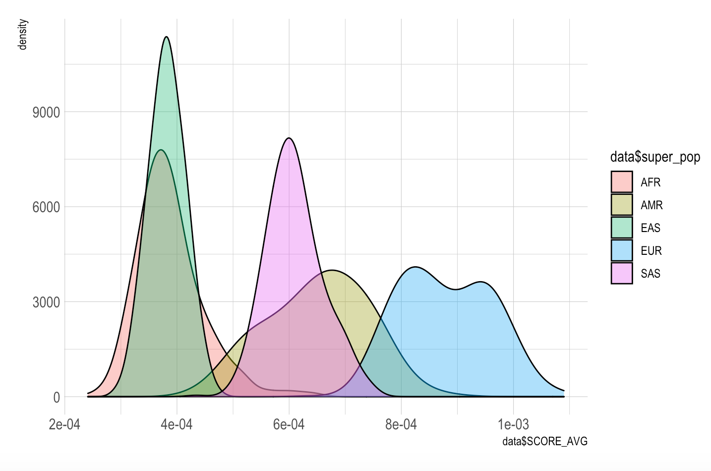

# Example_giant_height_wood_et_al_2014 
## Get started: 2014 height data structure


:octocat: Data name: GIANT_HEIGHT_Wood_et_al_2014_publicrelease_HapMapCeuFreq.txt

|MarkerName | Allele1 |Allele2 |Freq.Allele1.HapMapCEU | b| SE |p| N|
|---|---|---|---|---|---|---|---|
|rs4747841|  A|      G|       0.551|   -0.0011| 0.0029|  0.70 |   253213|
|rs4749917 | T|      C|       0.436|   0.0011 | 0.0029|  0.70 |   253213|
|rs737656 |  A|      G|       0.367|   -0.0062| 0.0030|  0.042|   253116|
|rs737657 |  A|      G|       0.358|   -0.0062| 0.0030|  0.041|   252156|
|rs7086391 | T|      C|       0.12|    -0.0087| 0.0038|  0.024|   248425|

## Which template to use?

|-|chr info in the file name| chr info not in the file name|
|---|---|---|
|chr info in the header|gene_atlas_model|gwas_model|
|chr info absent in the header|gene_atlas_model|gene_atlas_model|

:octocat: The chromosome information is absent in 2014 height data, and 
          2014 height data also has no header with Chromosome information. 
          Thus, I choose `gene_atlas_model` as template 

## step1 filtering SNPs

```python
from gprs.gene_atlas_model import GeneAtlasModel

if __name__ == '__main__':
    geneatlas = GeneAtlasModel( ref='1000genomes/hg19',
                    data_dir='data/2014_GWAS_Height' )

    geneatlas.filter_data( snp_id_header='MarkerName',
                            allele_header='Allele1',
                            beta_header='b',
                            se_header ='SE',
                            pvalue_header='p',
                            output_name='2014height')
```

:octocat: After filtering SNPs, three files obtained.
1. `result/snplists/2014height.csv`

|SNPID|
|---|
|rs737656|
|rs737657|
|rs7086391|

2. `result/qc/2014height.QC.csv`

|SNPID| Allele| Beta| SE |Pvalue|
|---|---|---|---|---|
|rs737656| A| -0.0062| 0.003| 0.042|
|rs737657| A| -0.0062| 0.003| 0.041|
|rs7086391| T| -0.0087| 0.0038| 0.024|

3. summary file: `/result/qc/[output_name].filteredSNP.withPvalue0.05.summary.txt` 

|no header|
|---|
|2014height: Total SNP BEFORE FILTERING: 2157028|
|2014height: Total SNP AFTER FILTERING: 395061|

## step2 use qc'd SNPs list to obtain Plink bfiles(.bed, .bim, .fam)

```python
from gprs.gene_atlas_model import GeneAtlasModel

if __name__ == '__main__':
    geneatlas = GeneAtlasModel( ref='1000genomes/hg19',
                    data_dir='data/2014_GWAS_Height' )

    geneatlas.generate_plink_bfiles(snplist_name='2014height', output_name='2014height')
```
:octocat: chr1-chr22 bfiles obtained

1. `result/plink/bfiles/chr(1-22)_2014height.bed`
2. `result/plink/bfiles/chr(1-22)_2014height.bim`
3. `result/plink/bfiles/chr(1-22)_2014height.fam`

## step3.1 remove linked SNPs

```python
from gprs.gene_atlas_model import GeneAtlasModel

if __name__ == '__main__':
    geneatlas = GeneAtlasModel( ref='1000genomes/hg19',
                    data_dir='data/2014_GWAS_Height' )

    geneatlas.clump(output_name='2014height',
                    clump_kb='250',
                    clump_p1='0.02', clump_p2='0.02',
                    qc_file_name='2014height',
                    plink_bfile_name='2014height')
```
:octocat: chr1-chr22 clumped files obtained

1. `result/plink/clump/*.clumped`

|CHR|F|SNP|BP|P|TOTAL|NSIG|S05|S01|S001|S0001|SP2|
|---|---|---|---|---|---|---|---|---|---|---|---|
|1   | 1   |rs1967017 | 145723645  | 3.72e-16   |    19  |    0  |    2   |   6  |    3  |    8 |rs11590105(1),rs17352281(1),rs9728345(1),rs11587821(1)|
|1   | 1  |  rs760077  |155178782 |  7.45e-10    |   12   |   0   |   2  |    2   |   1 |     7 |rs11589479(1),rs3766918(1),rs4625273(1),rs4745(1),rs12904(1)|

## step3.2 remove linked SNPs

```python
from gprs.gene_atlas_model import GeneAtlasModel

if __name__ == '__main__':
    geneatlas = GeneAtlasModel( ref='1000genomes/hg19',
                    data_dir='data/2014_GWAS_Height' )
    
    geneatlas.select_clump_snps(output_name='2014height',clump_file_name='2014height',
                           qc_file_name='2014height',
                                clump_kb='250',
                                clump_p1='0.02',
                                clump_r2='0.1')
```

:octocat: new snps list obtained

1. `result/plink/clump/*.qc_clump_snpslist.csv`

|CHR |SNP|
|---|---|
|1 |rs1967017|
|1 |rs760077|


## step4.1 Generate PRS model

```python
from gprs.gene_atlas_model import GeneAtlasModel

if __name__ == '__main__':
    geneatlas = GeneAtlasModel( ref='1000genomes/hg19',
                    data_dir='data/2014_GWAS_Height' )
    
    geneatlas.build_prs( vcf_input= '/home1/ylo40816/1000genomes/hg19',
                         output_name ='2014height', qc_file_name='2014height',memory='1000',
                         clump_kb='250',
                         clump_p1='0.02',
                         clump_r2='0.1')
```

:octocat: chr1-chr22 sscore files obtained 

1. `result/plink/prs/*.sscore`

|IID    |NMISS_ALLELE_CT |NAMED_ALLELE_DOSAGE_SUM| SCORE1_AVG|
|---|---|---|---|
|HG00096 |1912    |889     |0.0008466|
|HG00097 |1912    |884     |0.00119038|
|HG00099 |1912    |875     |0.000900628|

## step4.2 Combined PRS model

```python
from gprs.gene_atlas_model import GeneAtlasModel

if __name__ == '__main__':
    geneatlas = GeneAtlasModel( ref='1000genomes/hg19',
                    data_dir='data/2014_GWAS_Height' )
    
    geneatlas.combine_prs(pop='2014height_250_0.02_0.1')
```
:octocat: one combined sscore files obtained 

1. `result/plink/prs/*.sscore`

|id    |ALLELE_CT |SCORE_AVG| SCORE_SUM|
|---|---|---|---|
|HG00096 |59636.0    |0.0009896786363636364      |60.676823334000005|
|HG00097 |59636.0    |0.0009901211363636362     |60.46440781399999|
|HG00099 |59636.0    |0.0010224948181818182     |63.233378824|


## step5.1 Find the best-fit PRS

```python
from gprs.gene_atlas_model import GeneAtlasModel

if __name__ == '__main__':
    geneatlas = GeneAtlasModel( ref='1000genomes/hg19',
                    data_dir='data/2014_GWAS_Height' )
    
    geneatlas.prs_statistics(output_name='2014height', score_file = "/home1/ylo40816/Projects/GPRS/tmp/2014height_250_0.02_0.1.sscore",
        pheno_file = "/home1/ylo40816/Projects/GPRS/tmp/result/plink/prs/2014height_pheno.csv",
        r_command='/spack/apps/linux-centos7-x86_64/gcc-8.3.0/r-4.0.0-jfy3icn4kexk7kyabcoxuio2iyyww3o7/bin/Rscript',
        prs_stats_R="/home1/ylo40816/Projects/GPRS/gprs/prs_stats_quantitative_phenotype.R", data_set_name="2014height",
                             clump_kb='250',
                             clump_p1='0.02',
                             clump_r2='0.1'
                             )
```
:octocat: output stat.txt

1. `result/stat/*.stat.txt`

|data|filter_conditions |P| BETA|PseudoR2|OR_top1_to_middle20|OR_top2_to_middle20|OR_top5_to_middle20|OR_top10_to_middle20|
|---|---|---|---|---|---|---|---|---|
|2014height |250_0.02_0.1    | 0.5632    |0.0019|0.0002|0.5396|1.3899|0.9408| 1.2972|

##s step5.2(optional) Combined statistics results as one table

```python
from gprs.gene_atlas_model import GeneAtlasModel

if __name__ == '__main__':
    geneatlas = GeneAtlasModel( ref='1000genomes/hg19',
                    data_dir='data/2014_GWAS_Height' )
    
    geneatlas.combine_prs_stat(data_set_name='2014height',clump_kb='250',
                         clump_p1='0.02',
                         clump_r2='0.1')
```

:octocat: output combined_stat.txt

1. `result/stat/*combined_stat.txt`

|data|filter_conditions |P| BETA|PseudoR2|OR_top1_to_middle20|OR_top2_to_middle20|OR_top5_to_middle20|OR_top10_to_middle20|
|---|---|---|---|---|---|---|---|---|
|2014height |250_0.02_0.1    | 0.5632    |0.0019|0.0002|0.5396|1.3899|0.9408| 1.2972|
|2014height |250_0.02_0.1    | 0.5632    |0.0019|0.0002|0.5396|1.3899|0.9408| 1.2972|


## Visualize distribution of PRS in each population 

```R
# Libraries
library(ggplot2)
library(hrbrthemes)
library(dplyr)
library(tidyr)
library(viridis)

install.packages("hrbrthemes")

setwd("Desktop/PRS project/PRS_plot/")

data <- read.csv("2014height_w_popinfo.txt", sep=" ")

ggplot(data=data, aes(x=data$SCORE_AVG, group=data$super_pop, fill=data$super_pop)) +
  geom_density(adjust=1.5, alpha=.4) +
  theme_ipsum()

```




                                             
                    

